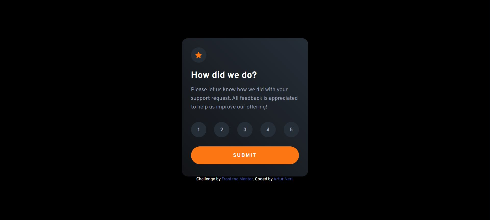
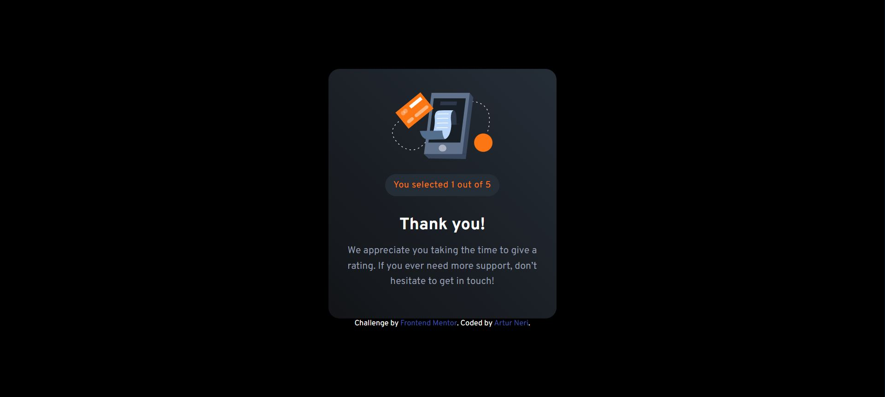

# Frontend Mentor - Interactive rating component solution

This is a solution to the [Interactive rating component challenge on Frontend Mentor](https://www.frontendmentor.io/challenges/interactive-rating-component-koxpeBUmI). Frontend Mentor challenges help you improve your coding skills by building realistic projects. 

## Table of contents

- [Overview](#overview)
  - [The challenge](#the-challenge)
  - [Screenshot](#screenshot)
  - [Links](#links)
- [My process](#my-process)
  - [Built with](#built-with)
  - [What I learned](#what-i-learned)
  - [Useful resources](#useful-resources)
- [Author](#author)

## Overview

### The challenge

Users should be able to:

- View the optimal layout for the app depending on their device's screen size
- See hover states for all interactive elements on the page
- Select and submit a number rating
- See the "Thank you" card state after submitting a rating

### Screenshots

### Links

- Solution URL: [View on Frontend Mentor](https://www.frontendmentor.io/solutions/interactive-rating-component-scss-vanilla-javascript-NHeHm_j6FP)
- Live Site URL: [View on browser](https://artur-neri.github.io/Interactive-Rating-Component/)

## My process

### Built with

- Semantic HTML5 markup
- CSS custom properties
- Flexbox
- Mobile-first workflow

### What I learned

In this project, the most satisfying part to practice was the style manipulation with JavaScript, because I have used DOM before, but only for HTML.

### Useful resources

- [Curso em Video](https://www.cursoemvideo.com/curso/javascript/) - This was my kickstart on JS. A 40 hour basic course.

## Author

- Frontend Mentor - [@Artur-Neri](https://www.frontendmentor.io/profile/Artur-Neri)

